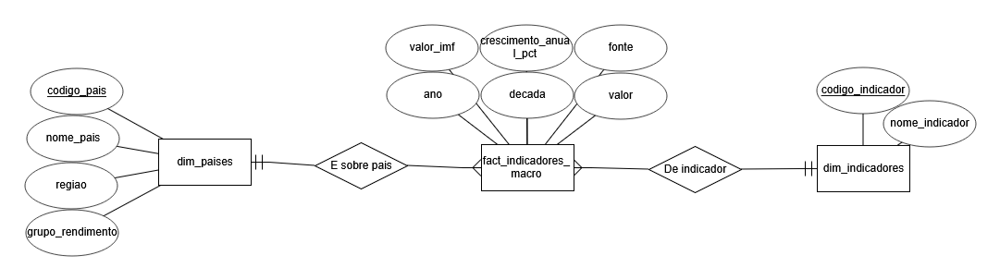
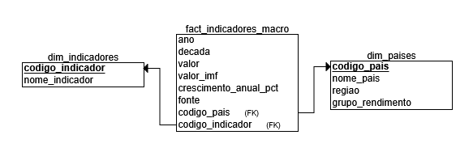

# Projeto_Etd

A modular ETL pipeline developed for the **Data Extraction and Transformation (ETD)** course. The project collects, integrates, transforms, and stores macroeconomic indicators from the **World Bank** and complementary sources, consolidating them into an analytical **Data Warehouse** designed for exploration and data analysis.

---

## Objective

The main objective of this project is to implement a complete ETL architecture capable of:

- Extracting data from multiple sources.
- Ensuring data quality and consistency.
- Integrating different economic datasets.
- Building a dimensional model for historical analysis.
- Providing structured data for analytical workloads.

---

## Selected Domain

The selected domain is **Global Economy and Development**.

The analysis focuses on macroeconomic and social indicators published by the World Bank, enabling the study of economic trends across countries over time and the identification of patterns between regions and income groups.

Analyzed indicators include:

- Gross Domestic Product (GDP) - current and constant USD
- GDP per capita and annual growth
- Inflation (CPI)
- Unemployment rate
- Gross capital formation
- Exports and imports (% of GDP)

---

## Project Architecture

```text
Projeto_Etd/
├── data/
│   ├── gold/
│   │   └── wdi_gold.csv
│   │
│   ├── db/
│   │   └── analytics_dw.db
│   │
│   ├── logs/
│   │   ├── load.log
│   │   └── transform.log
│   │
│   ├── silver/
│   │   └── wdi_staging.csv
│   │
│   └── raw/
│       ├── bulk/
│       │   ├── WDICSV.csv
│       │   └── WDICountry.csv
│       ├── api/
│       │   └── gdp_all.json
│       └── extra/
│           └── gdp.csv
│
├── docs/
├── sql/
│   └── schema.sql
│
└── src/
    ├── __init__.py
    ├── config.py
    ├── extract.py
    ├── transform.py
    └── load.py
```

---

## Technologies Used

- Python 3
- Pandas
- Requests
- SQLAlchemy
- SQLite
- World Bank API

---

## Data Sources

### 1. World Bank WDI Bulk Dataset (primary - large volume)

Static CSV download from the World Bank Data Catalog. Contains all World Development Indicators across all countries and years. Processed in chunks due to file size.

### 2. World Bank Indicators API

Used to retrieve up-to-date GDP data directly from World Bank REST services, paginated via `per_page` parameter.

### 3. IMF Complementary Dataset (gdp.csv)

Additional GDP series used to cross-validate and enrich the primary source. Joined to the main dataset via `(codigo_pais, ano)` key matching.

---

## Environment Setup

### 1. Obtain Bulk Data

Due to file size limitations, raw datasets are not included in the repository.

1. Access the official [World Bank Data Catalog](https://datacatalog.worldbank.org/search/dataset/0037712).
2. Download the **CSV File** package from the **World Development Indicators (WDI)** dataset.
3. Extract the files into:

```text
data/raw/bulk/
```

Expected files:

```text
WDICSV.csv
WDICountry.csv
```

### 2. Add Complementary Data Source

Place the following file:

```text
gdp.csv
```

inside:

```text
data/raw/extra/
```

### 3. Install Dependencies

```bash
pip install -r requirements.txt
```

---

## Pipeline Execution

### Phase 1 - Extract

```bash
python src/extract.py
```

Output: `data/raw/api/gdp_all.json`

### Phase 2 - Transform

```bash
python src/transform.py
```

Operations:

- Data cleansing (nulls, duplicates, type normalization).
- Multi-source integration (WDI bulk + API + IMF extra).
- Cross-source deduplication (API takes priority over bulk on conflict).
- Regional metadata enrichment via `WDICountry.csv`.
- Derived metric generation (annual growth %, decade column).
- Removal of World Bank regional aggregates (non-sovereign codes).
- Data quality reporting to log.

Outputs:

```text
data/silver/wdi_staging.csv   ← Silver layer (cleaned, integrated)
data/gold/wdi_gold.csv        ← Gold layer (analysis-ready)
data/logs/*.log       ← Quality reports
```

### Phase 3 - Load

```bash
python src/load.py
```

Output: `data/db/analytics_dw.db`

---

## Dimensional Model

The Data Warehouse follows a **Star Schema**, chosen for the following reasons:

- Analytical queries (aggregations by country, region, year, income group) are the primary workload - star schemas are optimised for this pattern.
- Denormalized dimensions reduce join complexity for dashboard queries.
- Clear separation between descriptive attributes (dimensions) and measurable facts (fact table) improves readability and maintainability.

### Entity-Relationship Diagram

<p align="center">
  
</p>

### Relational Schema

<p align="center">
  
</p>

### Storage Engine: SQLite

SQLite was chosen because:

- No external dependencies - runs on any machine without server setup (required by the project).
- Sufficient performance for this dataset size (~hundreds of thousands of rows).
- Full SQLAlchemy compatibility, making migration to PostgreSQL straightforward (change one connection string).

**Known limitation:** SQLite does not enforce foreign key constraints by default. Referential integrity is instead validated programmatically in `load.py` via LEFT JOIN checks, and documented in `load.log`.

### Indexes

The following indexes are created automatically by `load.py` to optimize dashboard queries:

| Index | Table | Column(s) | Purpose |
|---|---|---|---|
| `idx_fact_pais` | fact_indicadores_macro | `codigo_pais` | Filter/join by country |
| `idx_fact_indicador` | fact_indicadores_macro | `codigo_indicador` | Filter/join by indicator |
| `idx_fact_ano` | fact_indicadores_macro | `ano` | Time-series filtering |
| `idx_fact_decada` | fact_indicadores_macro | `decada` | Decade aggregations |
| `idx_fact_pk` | fact_indicadores_macro | `(codigo_pais, codigo_indicador, ano)` | Composite key for deduplication |

### Incremental Load Strategy

Dimension tables (`dim_paises`, `dim_indicadores`) use a **full refresh** strategy - they are small and replaced entirely on each run to reflect any upstream changes.

The fact table (`fact_indicadores_macro`) uses an **incremental append** strategy - on re-runs, only records with a new `(codigo_pais, codigo_indicador, ano)` key are inserted, preventing duplicates while preserving existing data.

---

## Data Quality Controls

The pipeline includes validation mechanisms across all phases:

| Check | Phase | Location |
|---|---|---|
| Missing values per indicator | Transform | `transform.log` |
| Duplicate records (cross-source) | Transform | `transform.log` |
| Regional aggregate removal | Transform | `transform.log` |
| Row count match (Gold vs DB) | Load | `load.log` |
| Chronological range (1960–2026) | Load | `load.log` |
| Referential integrity (orphan FKs) | Load | `load.log` |

---

## Generated Outputs

| Layer | File | Description |
|---|---|---|
| Raw | `gdp_all.json` | Data extracted from the World Bank API |
| Silver | `wdi_staging.csv` | Cleaned and integrated dataset |
| Gold | `wdi_gold.csv` | Analysis-ready dataset |
| DW | `analytics_dw.db` | Analytical Data Warehouse (SQLite) |
| Logs | `transform.log` | Data quality report (transform phase) |
| Logs | `load.log` | Load and integrity validation report |
